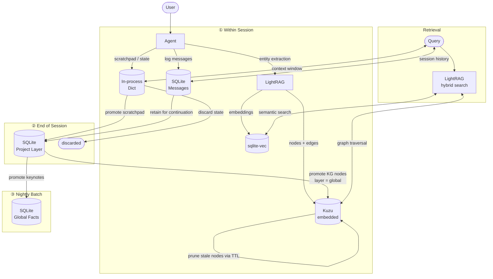

# Phase 1: Fundation

## Major Components
- CLI tools
- agent chat TUI (debug mode)
- llm router
- agent memory
- agent tools
- sandbox
- evaluate suite (w, w/o LLM)

## Memory Hierarchy

### Layers
| Layer   | Scope                      | Store      | Lifecycle |
|---------|----------------------------|------------|-----------|
| Session | single conversation        | In-process dict | discarded after session ends; scratchpad promotes to Project |
| Project | group of related sessions  | SQLite     | session history retained for continuation/resume |
| Global  | distilled fact keynotes    | SQLite     | long-lived; promoted from Project layer |

### Within Session
1. In-process dict: scratchpad and agent state (no daemon)
2. SQLite: session records written for continuation/resume

### Out of Session
1. End of session: scratchpad promotes to Project layer in SQLite
2. Nightly update: promote or prune Project → Global
3. TTL expiry: stale KG nodes pruned; Session layer discarded

### Knowledge Graph (Universal)
- Kuzu (embedded) + LightRAG spans all layers — not session-scoped
- No daemon required; Kuzu runs in-process like SQLite
- Live: entities and relationships extracted during active sessions
- Offline: nightly batch — promote, merge, prune via TTL

### Memory Flow



### Services:
- SQLite (Structured DB — `~/.craftsman/craftsman.db`)
- sqlite-vec (Vector DB — SQLite extension, same file as structured DB)
- Kuzu (Knowledge Graph — embedded, no daemon)
- LightRAG (KG orchestration: entity extraction, graph+vector hybrid retrieval)
- Local filesystem (artifact storage — `~/.craftsman/workspace/`)

## Tool Hierarchy

Full design rationale in [docs/research/2026-4-16-agent-tool-calls.md](./research/2026-4-16-agent-tool-calls.md).

### Meta

| Tool | Purpose |
|------|---------|
| `tool:list` | Enumerate registered tools with one-line descriptions |
| `tool:describe` | Return full JSON schema for a named tool |
| `tool:find` | Semantic search over tool descriptions; injects matching schema into next turn |
| `tool:compose` | Declare a pipeline of tool calls as a named macro |
| `tool:revoke` | Remove a tool from the active set for this session (append-only) |

Dynamic registry: store schemas in sqlite-vec; expose only `tool:find` + `tool:describe` by default. Inject schemas on demand to keep active tool count small.

### Bash

| Tool | Purpose |
|------|---------|
| `bash:ls` | List directory contents |
| `bash:cat` | Read file with `line_start` / `line_end` range |
| `bash:grep` | Search files by pattern |
| `bash:find` | Locate files by name or extension |
| `bash:head` / `bash:tail` | Sample large files without blowing context |
| `bash:stat` | Read timestamps and size without reading content |
| `bash:ps` | Check if a process is running |
| `bash:df` / `bash:du` | Disk usage |
| `bash_run` | Fallback for commands without a named tool; always tokenized via `shlex.split()` |

### Text

| Tool | Purpose |
|------|---------|
| `text:read` | Return `line_num + content`; enforces `max_lines` limit |
| `text:search` | Regex or literal search within a file; returns line numbers + context |
| `text:replace` | Replace matched pattern or line range; atomic write via temp-file + rename |
| `text:insert` | Insert lines at a specific `line_num` |
| `text:delete` | Delete a line range |

All write ops create a `.bak` before writing.

### Web

| Tool | Purpose |
|------|---------|
| `web:search` | Return titles, URLs, snippets |
| `web:fetch_url` | Fetch URL as Markdown (strip HTML server-side); enforce `max_chars` |
| `browser:navigate` | Navigate to URL; auto-dismiss cookie banners |
| `browser:get_accessibility_tree` | Structured page representation (prefer over raw HTML) |
| `browser:click` | Click element; built-in `wait_for_selector` |
| `browser:type` | Type into focused element |
| `browser:screenshot` | Capture viewport for canvas/SVG-heavy pages |
| `browser:eval` | Run arbitrary JS — last resort |

### Memory

| Tool | Purpose |
|------|---------|
| `memory:store` | Write key-value fact to scratchpad; update session KG |
| `memory:retrieve` | Hybrid fetch: KG traversal (Kuzu) + semantic similarity (sqlite-vec) |
| `memory:forget` | Remove a fact; triggers KG edge pruning |

### Plan / Task

State transitions enforced at the tool layer — programmatic guardrail, not a prompt instruction. Backend rejects invalid transitions regardless of agent reasoning.

```
pending → in_progress → verifying → done
                                   ↘ failed
```

| Tool | Purpose |
|------|---------|
| `plan:create` | Create a plan with goal + context (called after research, not before) |
| `plan:done` | Close a completed plan |
| `task:create` | Add a task to a plan with description + acceptance criteria |
| `task:start` | Transition `pending → in_progress` |
| `task:verify` | Check output against acceptance criteria; transition `in_progress → verifying` |
| `task:done` | Transition `verifying → done` |
| `task:fail` | Transition to `failed` with reason |
| `task:list` | List tasks for a plan with current status |

### Schedule

| Tool | Purpose |
|------|---------|
| `schedule:at` | Run a tool call once at a given datetime |
| `schedule:list` | List pending one-shot jobs |
| `schedule:cancel` | Cancel a pending job |
| `cron:create` | Schedule a recurring tool call (standard cron expression) |
| `cron:list` | List active cron jobs |
| `cron:remove` | Delete a recurring job |
