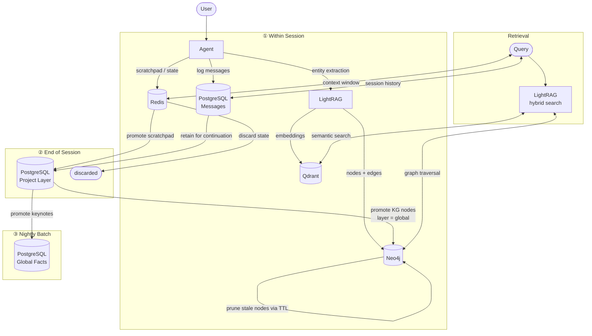

# Roadmap

## Phase 1: Fundation

### Major Components
- CLI tools
- agent chat TUI (debug mode)
- llm router
- agent memory
- agent tools
- sandbox
- evaluate suite (w, w/o LLM)

## Memory Hierarchy

### Layers
| Layer   | Scope                      | Store      | Lifecycle |
|---------|----------------------------|------------|-----------|
| Session | single conversation        | Redis      | discarded after session ends; scratchpad promotes to Project |
| Project | group of related sessions  | PostgreSQL | session history retained for continuation/resume |
| Global  | distilled fact keynotes    | PostgreSQL | long-lived; promoted from Project layer |

### Within Session
1. Cache (Redis): scratchpad and agent state
2. Structure DB (PostgreSQL): session records for continuation/resume

### Out of Session
1. End of session: scratchpad promotes to Project layer
2. Nightly update: promote or prune Project → Global
3. TTL expiry: stale nodes pruned; Session layer discarded

### Knowledge Graph (Universal)
- Neo4j + LightRAG spans all layers — not session-scoped
- Live: entities and relationships extracted during active sessions
- Offline: nightly batch — promote, merge, prune via TTL

### Memory Flow

## Services:
- Redis (Cache + Message Queue via Streams)
- PostgreSQL (Structured DB)
- Qdrant (Vector DB)
- Neo4j (Knowledge Graph)
- LightRAG (KG orchestration: entity extraction, graph+vector hybrid retrieval)
- SeaweedFS (object/artifact storage)
- craftsman server (always on, bg worker)
- craftsman client (worker, mount workspace)
